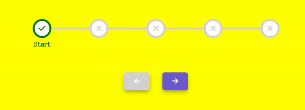
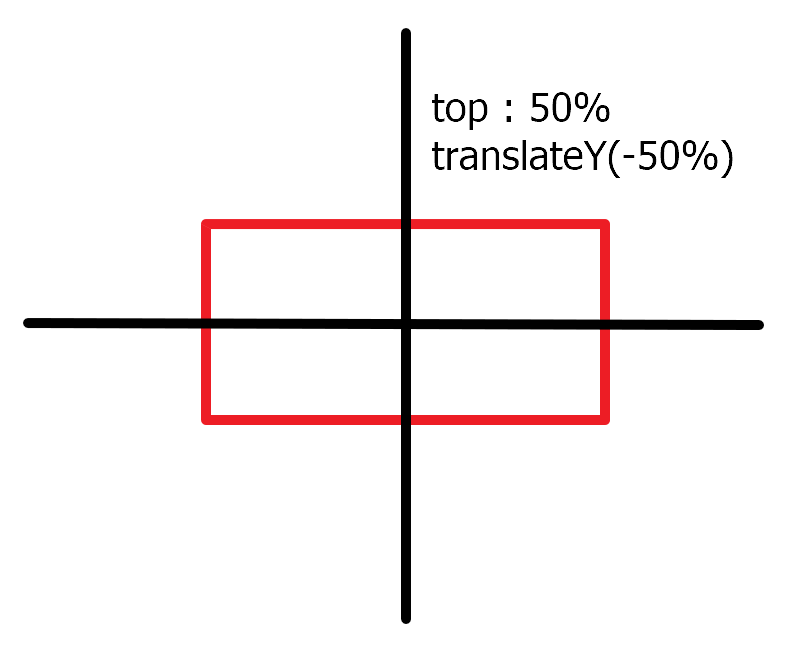

# Step-Progress-Bar


## 기능
버튼을 클릭하면 다음 단계로 넘어가는 애니메이션 기능 구현

<br>

## 사용한 라이브러리  
**fontawesome**  : 아이콘 사용  
https://fontawesome.com/

<br>

## 학습

### 1. css : z-index
: 위치 지정 요소와, 그 자손 또는 하위 플렉스 아이템의 Z축 순서를 지정   
: position 속성을 이용하면 요소를 겹치게 놓을 수 있습니다. 이때 요소들의 수직 위치를 z-index 속성으로 정합니다. 값은 정수이며, 숫자가 클 수록 위로 올라오고, 숫자가 작을 수록 아래로 내려갑니다.

```
/* 키워드 값 */
z-index: auto;  <!-- 기본값  -->

/* <integer> 값 */
z-index: 0;
z-index: 3;
z-index: 289;
z-index: -1; /* 음수 값으로 우선순위를 낮출 수 있음 */

/* 전역 값 */
z-index: inherit;
z-index: initial;
z-index: unset;

```

### 2. css : top50%과 translateY(-50%)
가운데 수직 정렬을 위해 사용

<u>top 50%을 적용했을 때</u>  

요소의 상단을 기준으로 50%만큰 이동였다. 그러므로 위치상 봤을 때 가운데로 오지 않음.    

  

<U>top 50%+ translateY(-50%)</U>  

정 가운데로 수직 정렬을 하기 위해 요소의 높이 반만큼 y축으로 -50%만큼 이동을 하면 가운데로 수직 정렬이 된다.  
  

<br>

### 3. js : 버튼 활성화, 비활성화 

```
target.disabled = false;
target.disabled = true;
```


<br>

## 학습 출처
**유튜브**  
https://www.youtube.com/@JavaScriptKing   

**top50과 translateY(-50%)**  
https://kin.naver.com/qna/detail.naver?d1id=1&dirId=105&docId=429186325&qb=JUVCJTgyJTk4JUVEJTk4JUJDJUVDJTlFJTkwJUVDJTgyJUIwJUVCJThCJUE0ICVFQyU5RSVBQyVFQiVCMCVBOSVFQyU4NiVBMQ==&enc=utf8&section=kin.qna&rank=890&search_sort=0&spq=0

**css관련**  
https://developer.mozilla.org/   
https://www.w3schools.com/ 